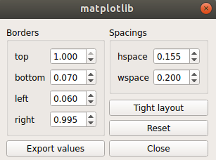

# Matplotlib


## Which fonts to choose

There is a nice article on which fonts to choose for scientific publication. If you want you may read it [here](https://doi.org/10.1021/acs.chemmater.6b00306). 

The answer is 
```
**“Arial or Helvetica, always.”**
```
Arial are quite old and they actually do not look good. So the only option that we have is [Helvetica](./Helvetica-Font-Family.zip). Helvetica fonts do not come with matplotlib by default. So we have to download them separetely and add them to matplotlib **TTF fonts** folder.The [Helvetica fonts family](./Helvetica-Font-Family.zip) is provided in this git repository.

### Helvetica with Matplotlib

Step by step procedure to setup Helvetica fonts with matplotlib is as follows

1. Extract all [Helvetica](./Helvetica-Font-Family.zip) fonts.
2. Find matplotlib fonts folder.

Generally matplotlib access the fonts from `{active-env}/lib/python3.10/site-packages/matplotlib/mpl-data/fonts/ttf` on Linux or `{active-env}\Lib\site-packages\matplotlib\mpl-data\fonts` on Windows. If this directory does not work then find path by these commands

```Python
import matplotlib
print(matplotlib.matplotlib_fname())
```

3. Just copy all the extracted fonts to matplotlib `fonts/ttf` folder.

4. Clear Matplotlib cache. 

```bash
rm ~/.cache/matplotlib/ -rf
```
5. Now matplotlib should work fine with Helvetica fonts.


## Adjust multiple subplots (layout)

**Do not ever use tight-layout.** 

Instead to use `plt.subplots_adjust()` to do the same. If tweaking these params seems tricky to you. You can first directly plot the figure and `matplotlib ui` provides control to adjust `top, bottom, left, right, wspace, hspace` parameters. Once your plot looks nice. Just export these parameters. 



Always plot the figs in smaller dpi. 100 is a good choice. When the plot look okay. Then while exporting increase the dpi to 300 or larger whatever you want. Exporting in `svg` format you don't even need to define dpi. 