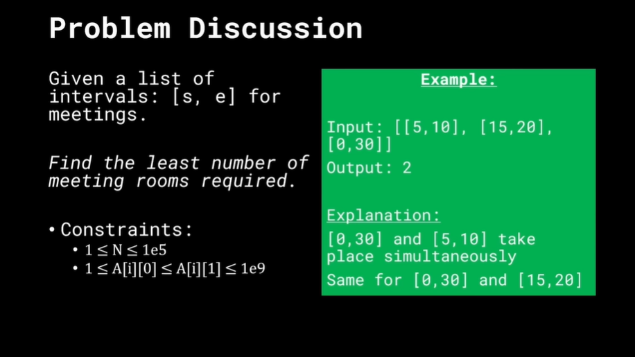
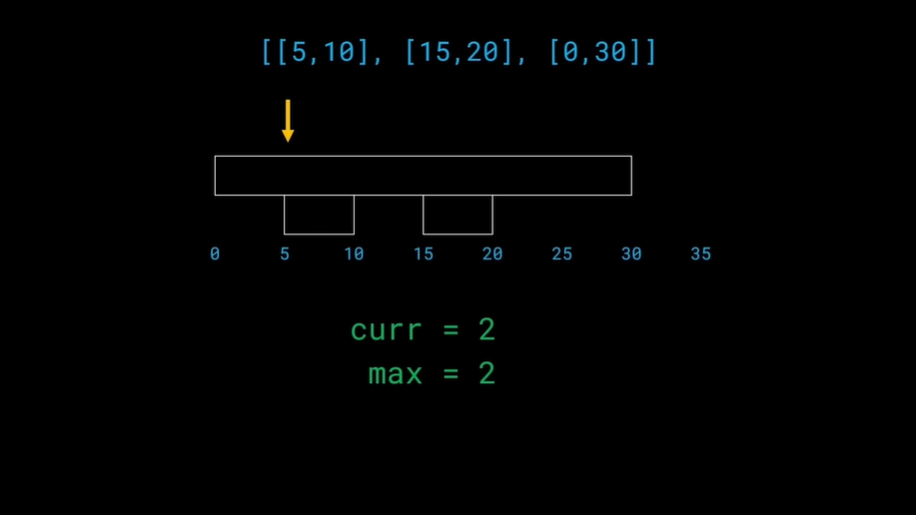
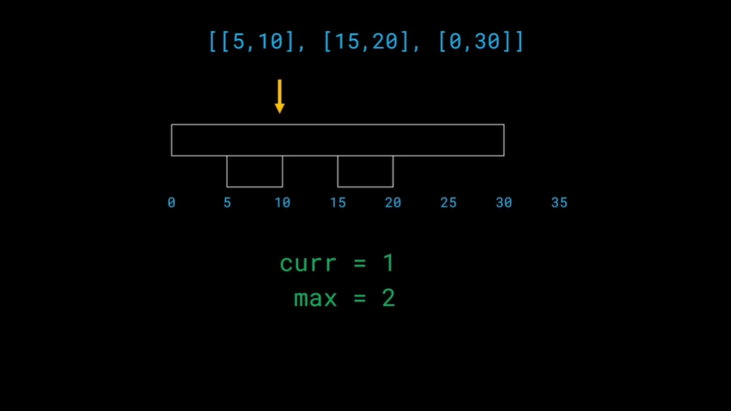
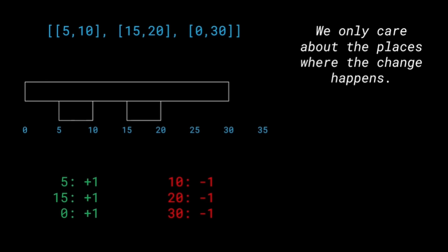
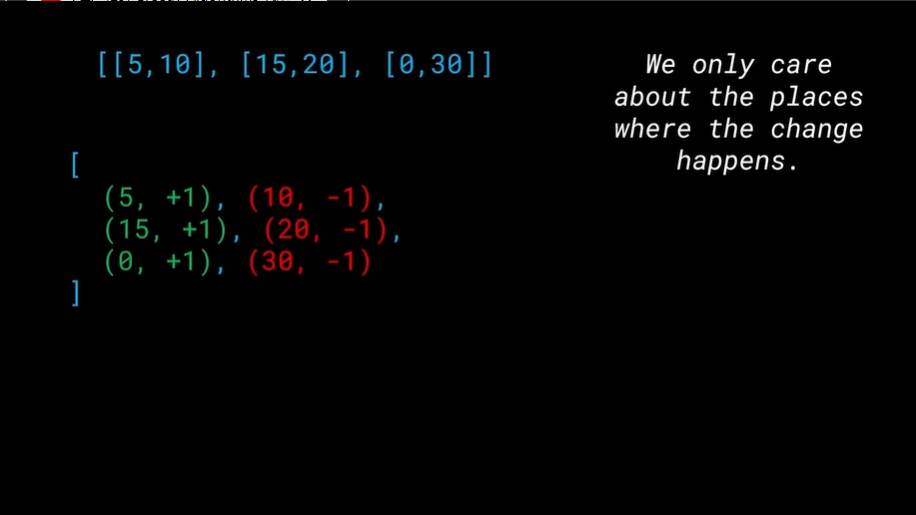
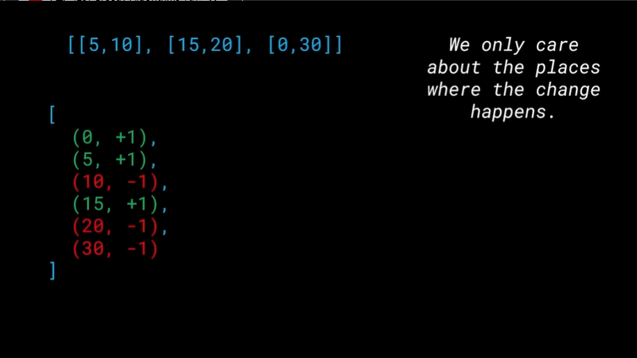
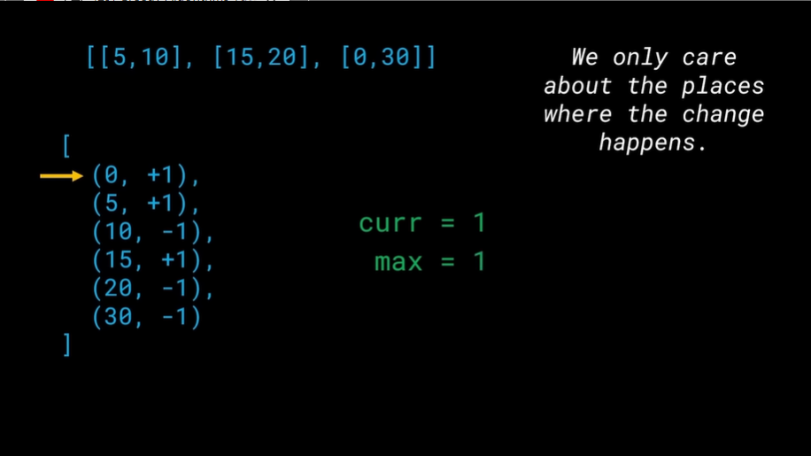
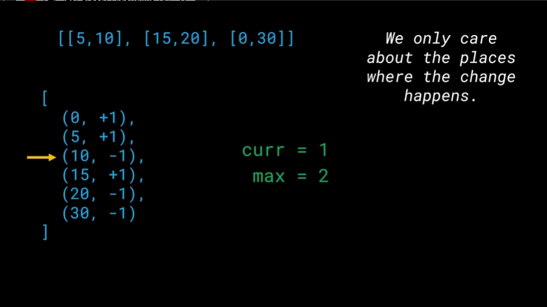
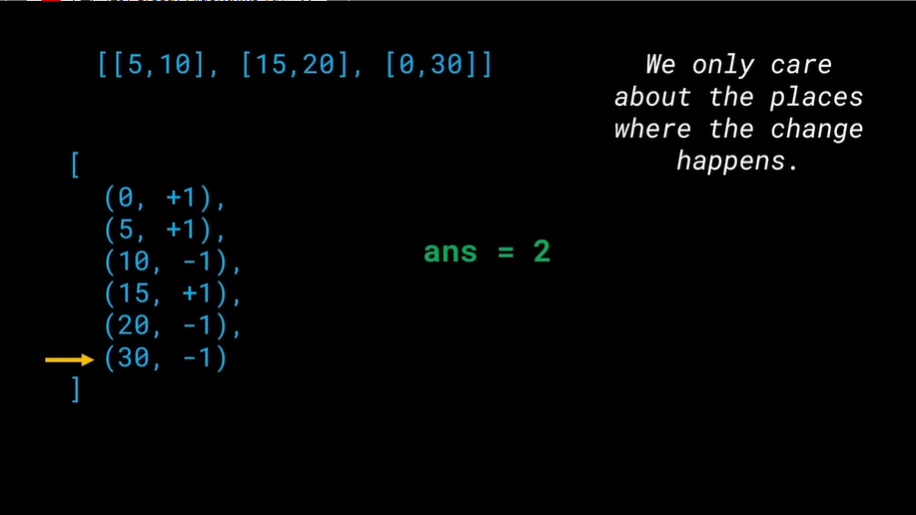

# Meeting Rooms

s,e = start,end

## Logic

We keep track of `no of rooms currently occupied` and `maximum room nums of room occupied till now`.

At start of meething we assign +1
At end of meeting we assign -1

