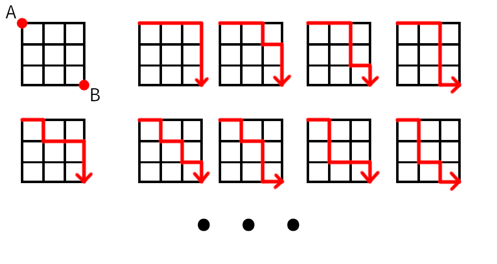

# Finding Nemo

You are given a N*M grid with rows ranging from 1 ot N and colums from 1 to M. You are at position (1,1) and Nemo
is at (N,M). Your task is to evauate and print all the possible paths that leads to NEMO. 

Beware you can only move right or down.

Some example paths are shown below

