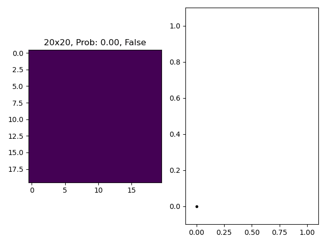

# Percolation Problem



## Problem

We have a NxM grid. Each grid element element contains either 1 or 0. 0 denotes a closed path and 1 denotes an open one. The given grid
percolates if and only if there exist some kind of connection between the first row of the grid to the last row of grid.

If you want to go one step ahead you can assign ones and zeros with some probability and then find out the threshold probablity after which
the given grid always percolates.

## Solution

We will use the union find algorithm to solve this puzzle.

## Creating GIF

```
magick -delay 200 -loop 0 ./out/*.png anim.gif
```