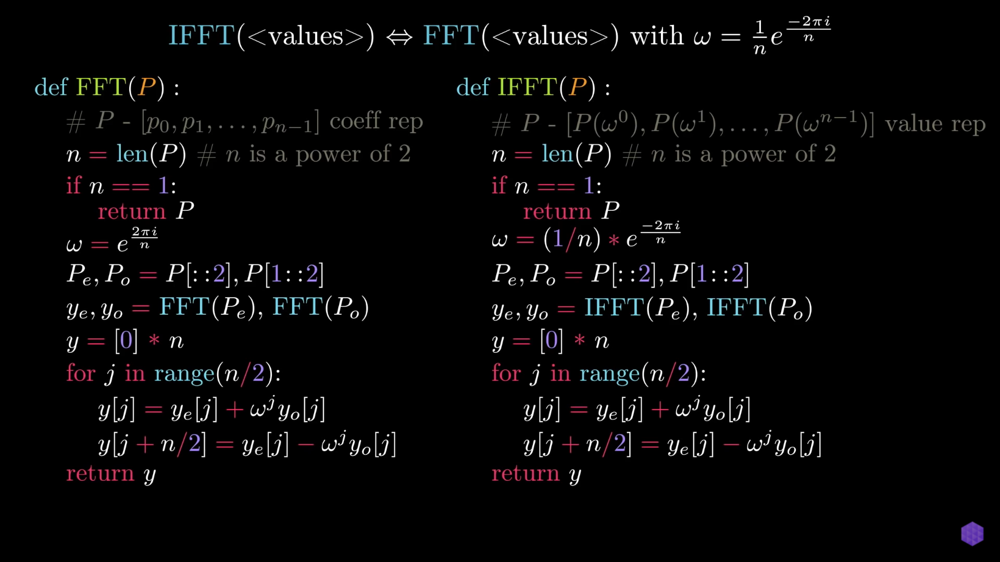

# Fast-Fourior-Transform

An efficient algorithm to find multiplication of two polynomial. Two most important aspects of this algorithm is FFT and IFFT.

## References

1. https://www.youtube.com/watch?v=h7apO7q16V0